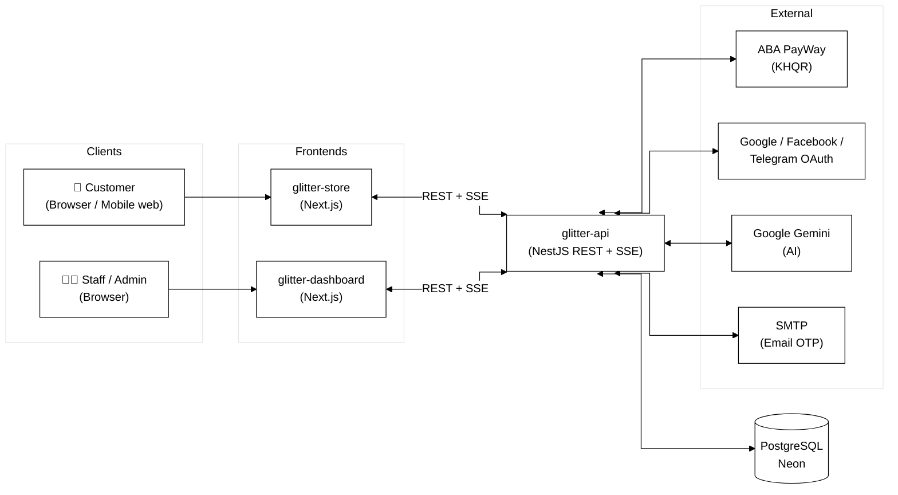
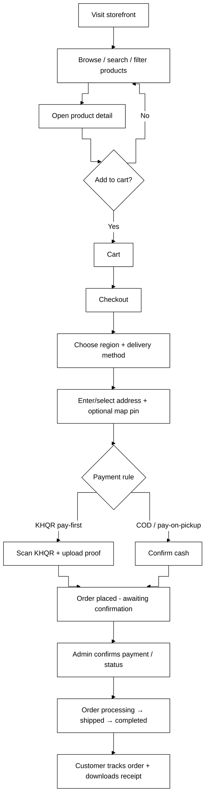
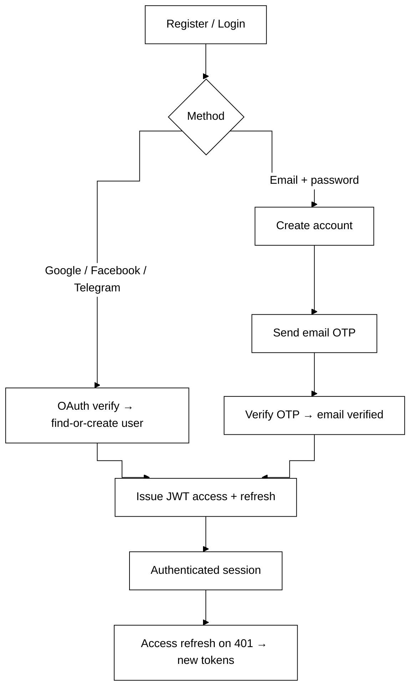
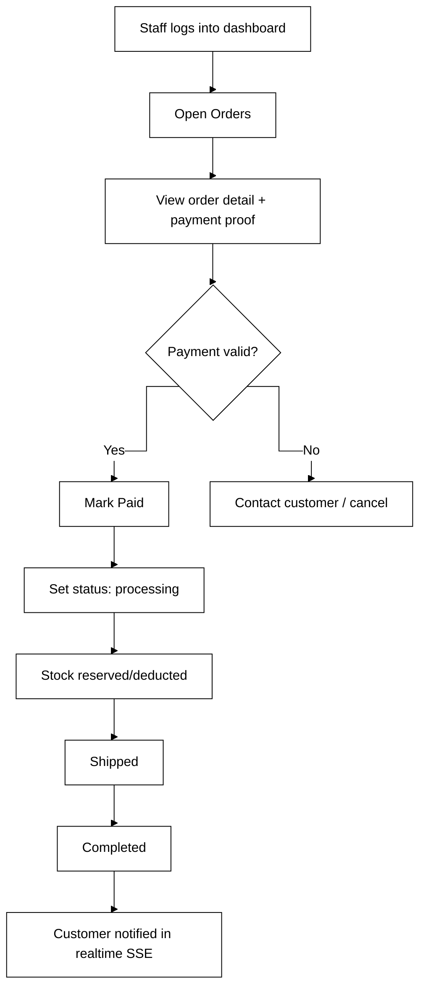
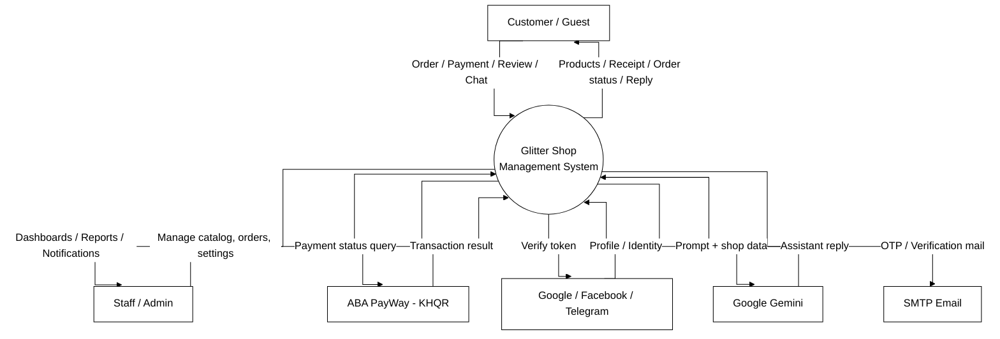
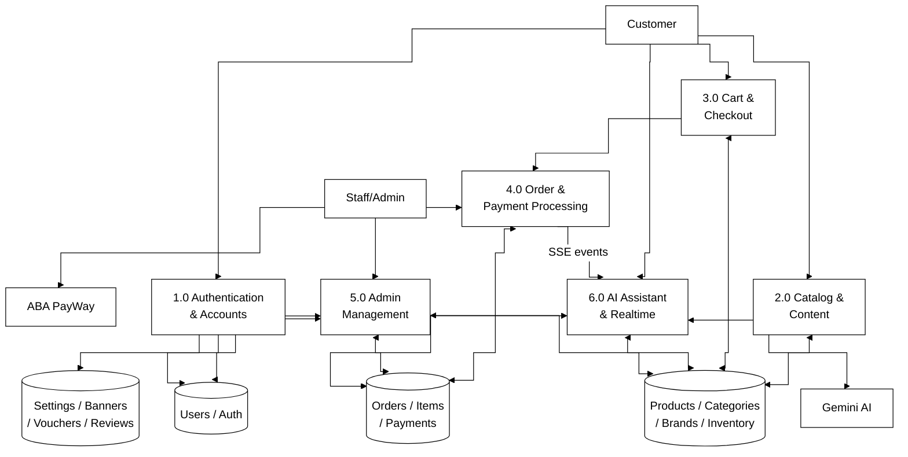
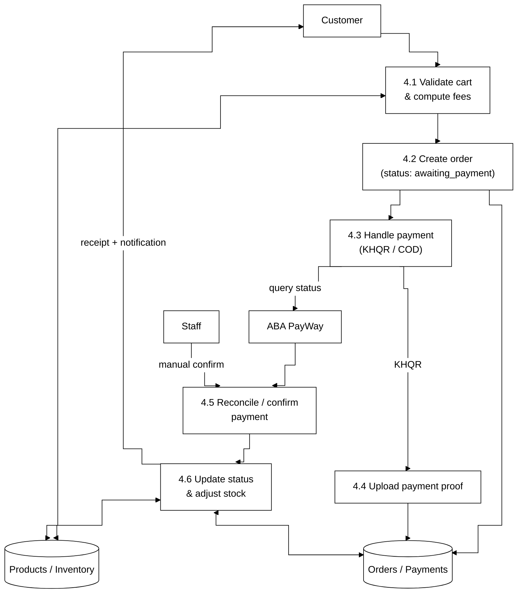
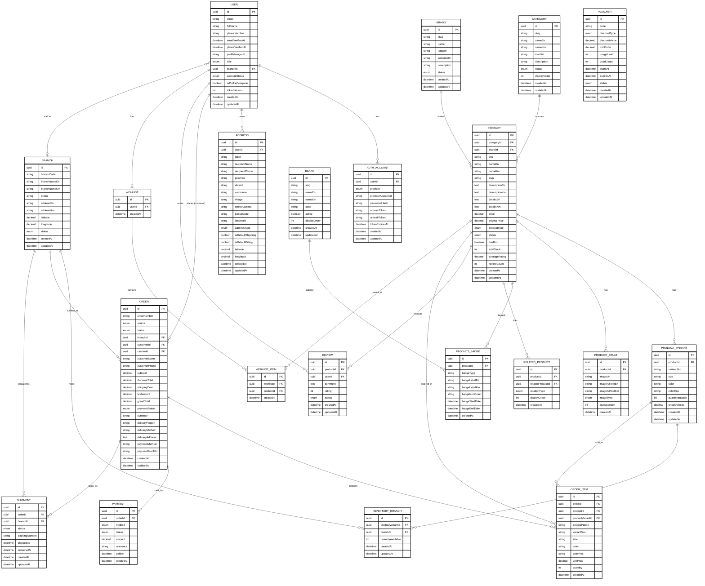
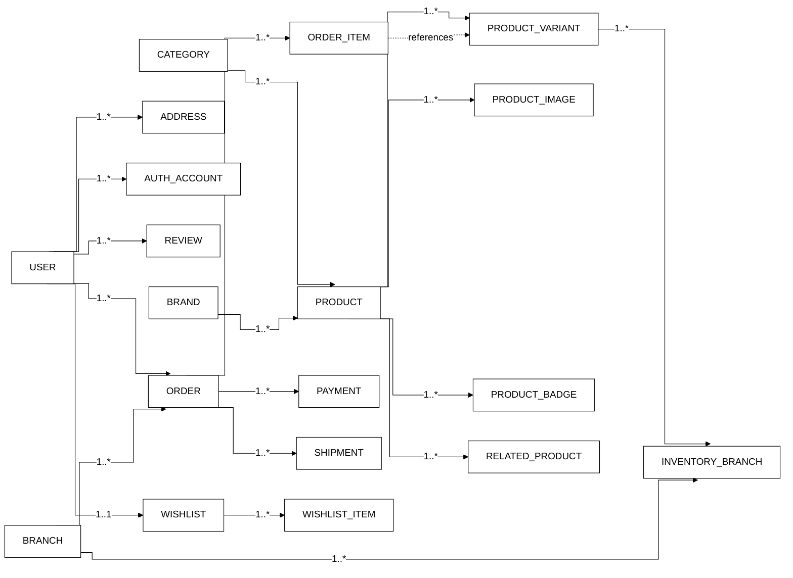

# 🛍️ Glitter Shop — E‑Commerce Platform

A full‑stack, bilingual (English / ខ្មែរ) e‑commerce system for a Cambodian retail shop, built as a Year‑4 thesis project. It consists of **three applications** sharing one database.

| App | Tech | Purpose | Users |
|---|---|---|---|
| **glitter-store** | Next.js (App Router) | Customer‑facing online shop | Customers, guests |
| **glitter-dashboard** | Next.js (App Router) | Admin/staff back‑office | Super admin, admin, manager, cashier |
| **glitter-api** | NestJS + TypeORM | REST API + realtime + business logic | (backend for both) |
| **Database** | PostgreSQL (Neon) | Single source of truth | — |

**Cross‑cutting features:** JWT auth (access + refresh), OAuth login (Google / Facebook / Telegram), realtime updates via SSE, AI shopping assistant (Google Gemini), image uploads, email OTP verification (SMTP), ABA **KHQR** payments, dark/light mode, and full EN/KM localization.

---

## 📑 Table of Contents
1. [System Architecture](#-system-architecture)
2. [User Roles & Permissions](#-user-roles--permissions)
3. [Storefront Features (glitter-store)](#-storefront-features-glitter-store)
4. [Dashboard Features (glitter-dashboard)](#-dashboard-features-glitter-dashboard)
5. [User Journey Flows](#-user-journey-flows)
6. [Diagrams](#-diagrams)
   - [Context Diagram (DFD Level 0)](#context-diagram--dfd-level-0)
   - [Data Flow Diagram — Level 1](#data-flow-diagram--level-1)
   - [Data Flow Diagram — Level 2 (Checkout & Payment)](#data-flow-diagram--level-2-checkout--payment)
   - [Entity Relationship Diagram (ERD)](#entity-relationship-diagram-erd)
   - [Relationship Diagram](#relationship-diagram)
7. [Getting Started](#-getting-started)
8. [Deployment](#-deployment)

---

## 🏗 System Architecture



- **REST** for all data operations; **SSE (`/api/realtime/events`)** pushes live updates (e.g. an admin edit instantly refreshes the storefront / dashboard lists).
- The API is a **persistent server** (needed for SSE + background reconciliation jobs), so it is hosted on a container platform (Render/Koyeb), while the two Next.js apps deploy to **Vercel**.

---

## 👥 User Roles & Permissions

Access is enforced by a global JWT guard plus a `@Roles()` guard on the API. There are **five roles**:

| Role | Where | Capabilities |
|---|---|---|
| **super_admin** | Dashboard | Full system control. Everything `admin` can do **plus** exclusive actions: manage staff & role assignments and critical global settings. |
| **admin** | Dashboard | Manage the full catalog, orders, customers, promotions, reviews, branches, inventory, and all content/app settings. |
| **manager** | Dashboard | Operational management: products, product variants/badges/images, categories, brands, colors, inventory (branch stock), and orders. No staff/critical‑settings access. |
| **cashier** | Dashboard (POS) | In‑store point‑of‑sale: create walk‑in orders, take payment, look up products & branch stock. No management screens. |
| **customer** | Storefront | Shop the store: browse, search/filter, cart, checkout, track orders, wishlist, write reviews, manage their account & addresses, connect social logins. No dashboard access. |

> Roles are hierarchical in practice: `super_admin ⊇ admin ⊇ manager`, with `cashier` scoped to sales operations and `customer` scoped to the storefront.

---

## 🛒 Storefront Features (glitter-store)

The customer web app — a native‑app‑style, bilingual (EN/KM), light/dark storefront.

### Browsing & Discovery
- **Home page** — configurable sections (hero **banner carousel**, best sellers, new arrivals, category grids, promotional strips) managed from the dashboard.
- **Product catalog** (`/products`) — paginated grid with:
  - **Live search** (debounced, instant results).
  - **Sort**: newest, price low→high, price high→low, name A→Z, top rated.
  - **Filters**: **price range** (min/max), **brand** multi‑select, **category** chips.
  - **Curated views**: "Best sellers" and "New arrivals" get a dedicated hero when reached from the home page.
- **Product detail** (`/products/[slug]`) — image gallery, variants (size/color with swatches), price/discount, stock/availability per branch, badges, star ratings & **reviews**, related products, add‑to‑cart with quantity, wishlist toggle.
- **Brands** (`/brands`) and **Categories** browsing.
- **Store locations** (`/stores`) — branch list with contact info.
- **Promotions** (`/promotion`) — active vouchers / offers.
- **Dynamic content pages** (`/[slug]`) and **About** page (managed in the dashboard).

### Cart & Checkout
- **Cart** (`/cart`) — item list with quantity steppers, remove, live subtotal, free‑delivery hint.
- **Checkout** (`/checkout`) — a Cambodia‑style flow:
  - **Shipping region**: Phnom Penh vs Province.
  - **Delivery method** (region‑filtered): COD, Grab, Pickup (branch selector), VET Express — each with its own fee and payment rule.
  - **Payment**: **ABA KHQR** (scan QR, upload proof) or **Cash** (COD / pay‑at‑pickup) depending on the method.
  - **Address**: text address + optional **Google Maps pin**; logged‑in users reuse saved addresses.
  - Server‑computed shipping fees (anti‑tamper), voucher application, order summary.
- **Order confirmation & receipt** — downloadable receipt (rendered to image).

### Account & Engagement
- **Register / Login** (`/account/login`, `/account/register`) — email+password or **Google / Facebook / Telegram** OAuth; **email OTP verification**.
- **My account** (`/account`) — profile, appearance settings (language + dark/light), **connected social accounts** (link/disconnect), phone validation.
- **My orders** (`/account/orders`, `/account/orders/[id]`) — native‑app order list + detail with status timeline and **receipt download**.
- **Wishlist** (`/account/wishlist`).
- **Notifications** — order/status updates.
- **🤖 AI Shopping Assistant** — a floating chatbot (animated robot launcher) that answers questions about **products** (incl. "find the cheapest"), **delivery & payment**, **store info**, and a signed‑in customer's **order status**, replying in the language the customer writes in.

---

## 🖥 Dashboard Features (glitter-dashboard)

The staff back‑office. Every module below is a set of list/detail/create/edit screens with search, realtime refresh, and role‑gated actions.

### Overview
- **Dashboard home** (`/dashboard`) — KPI stats (total orders, today's orders & revenue, order‑status breakdown) and charts.

### Catalog Management
- **Products** — full CRUD with a rich multi‑section form: basic info (bilingual), pricing (price + original/discount), **variants** (size/color/hex, per‑variant stock & price override), **images** (multi‑upload, primary), **badges**, **organization** (category/brand/type/status), **related products**, and **AI‑assisted** description/detail generation.
- **Categories**, **Brands**, **Colors**, **Badges** — CRUD with icons/logos and bilingual names; AI‑assisted brand/category descriptions.
- **Inventory** — branch‑level stock management (`inventory_branch`): set/adjust quantity available per variant per branch.

### Sales
- **Orders** — list with filters, detail view (items, delivery method/region, address + map link, payment method, **payment‑proof image**, status), status transitions with stock side‑effects, **payment confirmation** (mark paid), and printable **receipt**.
- **POS / New order** (`/dashboard/orders/new`) — cashier creates a walk‑in order, adds items, applies discounts, takes payment.

### Customers & Staff
- **Customers** — CRUD (profile photo, contact, addresses with map), soft‑delete (frees the email for re‑use), hide deleted from lists.
- **Staff** — CRUD for admin/manager/cashier accounts with role assignment (super_admin).
- **Branches** — store branches CRUD (contact, location).

### Marketing & Content
- **Promotions / Vouchers** — discount codes and offers.
- **Advertisements** — placements/slots for promotional creatives.
- **Reviews** — moderate product reviews.
- **App Settings**:
  - **General** — shop name/tagline/footer (bilingual), **logo** management (add/edit/set active, corner‑rounding), **Delivery & Payment** config (regions, methods, fees, KHQR config).
  - **Banners** — hero banners (image upload with **aspect‑ratio validation**, scheduling, placements, status).
  - **Theme** & **Appearance** — brand color, fonts, product grid density, default sort.
  - **Home / Sections** — enable/reorder homepage sections.
  - **Navigation**, **Contact**, **About** — menu items, contact channels, about page content.

### Personal
- **Profile** & **Change password**.

---

## 🧭 User Journey Flows

### A. Customer purchase journey


### B. Authentication journey


### C. Staff order‑fulfilment journey


---

## 📊 Diagrams

### Context Diagram — DFD Level 0
The whole system as a single process with its external entities.



### Data Flow Diagram — Level 1
The main internal processes and data stores.



### Data Flow Diagram — Level 2 (Checkout & Payment)
Drill‑down of process **4.0 Order & Payment Processing**.



### Entity Relationship Diagram (ERD)
Full physical data model — every table with its columns and crow's‑foot relationships.



### Relationship Diagram
A simplified view of how the main entities connect (cardinalities).



---

## 🚀 Getting Started

Each app has its own `.env.example` — copy it and fill in values.

```bash
# 1. API (NestJS) — http://localhost:5000
cd glitter-api
cp .env.example .env      # fill DATABASE_URL, JWT secrets, keys…
npm install
npm run start:dev

# 2. Storefront (Next.js) — http://localhost:3000
cd glitter-store
cp .env.example .env.local # set NEXT_PUBLIC_API_URL=http://localhost:5000
npm install
npm run dev

# 3. Dashboard (Next.js) — http://localhost:3001
cd glitter-dashboard
cp .env.example .env.local # set NEXT_PUBLIC_API_URL=http://localhost:5000
npm install
npm run dev
```

- **Database**: PostgreSQL (Neon). TypeORM `synchronize: true` builds the schema on boot (dev).
- **Seed admin**: created on first boot from `SEED_ADMIN_*` env vars.
- **Swagger API docs**: `http://localhost:5000/swagger`.

---

## ☁ Deployment

| App | Host | Notes |
|---|---|---|
| **glitter-api** | Render / Koyeb | Persistent server (needed for SSE + jobs). Set all `.env` vars + `ALLOWED_ORIGINS` (the Vercel domains). |
| **glitter-store** | Vercel | Root dir `glitter-store`; set `NEXT_PUBLIC_API_URL` to the API URL. |
| **glitter-dashboard** | Vercel | Root dir `glitter-dashboard`; same `NEXT_PUBLIC_API_URL`. |
| **Database** | Neon | Use a region close to users (e.g. Singapore) for latency. |

**Production CORS**: the API allows `localhost` in dev and the domains listed in `ALLOWED_ORIGINS` (comma‑separated) in production. **OAuth**: add the production domains to the Google/Facebook consoles.

---

*Glitter Shop — Year‑4 Thesis Project.*
